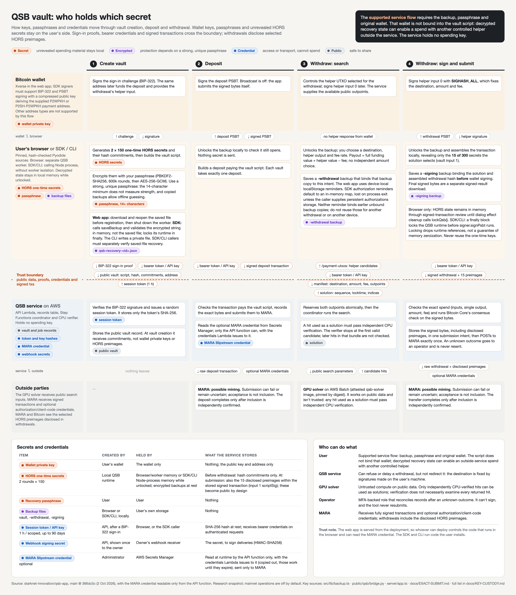

# Key custody

Who holds each key, passphrase and credential through vault creation, deposit and withdrawal, and what the service receives. This page is the text version of the [diagram](key-custody.png); its source is [`key-custody.html`](key-custody.html).

**The supported app/service withdrawal flow requires the backup file, its passphrase and the original wallet. The service holds no spending key.** The original wallet is a service-enforced requirement, not a condition in the vault script: someone with decrypted recovery state could use a helper they control to construct a spend outside the service. Wallet private keys, recovery passphrases and unrevealed HORS secrets stay on the user's side. The service also receives the BIP-322 sign-in proof and bearer session tokens or API keys. Signed withdrawals intentionally disclose selected HORS preimages.

## Holders

- **Bitcoin wallet**: Xverse in the web app; SDK signers must support BIP-322 and PSBT signing with a compressed public key deriving the supplied P2WPKH or P2SH-P2WPKH payment address. Other address types are not supported by this flow. Holds the wallet private key.
- **User's browser, or the SDK / CLI**: runs pinned, hash-checked QSB sources through Pyodide. The browser uses a separate worker; the SDK/CLI runs Pyodide in the calling Node process, without worker isolation. Decrypted HORS state is held in browser/worker memory or SDK/CLI process memory; passphrases and backup files stay on the user’s side.
- **QSB service on AWS**: API Lambda, records table, Step Functions coordinator and CPU verifier. Holds vault and job records, session and API key hashes and webhook secrets, and reads the MARA credential. Holds no spending key.
- **Outside parties**: The GPU solver receives public search inputs. MARA receives signed transactions and optional authorization/client-code credentials. MARA and Bitcoin see the selected HORS preimages disclosed in withdrawals.

## 1. Create vault

| Holder | What happens |
| --- | --- |
| Wallet | Signs the sign-in challenge (BIP-322). The same address later funds the deposit and provides the withdrawal's helper input. |
| Wallet ↔ browser | The challenge goes to the wallet; the signature comes back. |
| Browser | Generates 2 × 150 one-time HORS secrets and their hash commitments, then builds the vault script. Encrypts them with the passphrase (14+ characters; PBKDF2-SHA256 with 600,000 rounds, then AES-256-GCM). Use a strong, unique passphrase: the 14-character minimum does not measure strength, and a copied backup allows offline guessing. In the web app, the user downloads `qsb-recovery-<id>.json` and reopens the saved file for verification before registration; then the worker is shut down. The SDK calls saveBackup, then decrypts and validates the in-memory encrypted string, not the persisted file. The CLI callback writes a private local file. SDK/CLI callers must separately check saved-file recovery; the SDK locks its runtime in finally. |
| Crosses to the service | The BIP-322 sign-in proof, then the public vault (script, script hash, HORS commitments and payment address). The service returns a 1-hour session token. Authenticated requests send that bearer token, or a scoped API key. |
| Service | Verifies the BIP-322 signature and issues a random session token, storing only its SHA-256. Stores the public vault record. At vault creation it receives commitments, not wallet private keys or HORS preimages. |
| Outside parties | Nothing leaves the service. |

## 2. Deposit

| Holder | What happens |
| --- | --- |
| Wallet | Signs the deposit PSBT. Broadcast is off: the app submits the signed bytes itself. |
| Wallet ↔ browser | The deposit PSBT goes to the wallet; the signed PSBT comes back. |
| Browser | Unlocks the backup locally to check it still opens; nothing secret is sent. Builds a deposit paying the vault script. Each vault takes exactly one deposit. |
| Crosses to the service | The signed deposit transaction plus a bearer session token or API key. |
| Service | Checks the transaction pays the vault script, records the exact bytes and submits them to MARA. Reads the optional MARA credential from Secrets Manager; only the API function can, with the credentials Lambda issues to it. |
| Outside parties | MARA receives the signed transaction and optional authorization/client-code credentials for possible mining. Submission may fail or remain uncertain; acceptance is not block inclusion. The deposit completes only after inclusion is independently confirmed. |

## 3. Withdraw: search

| Holder | What happens |
| --- | --- |
| Wallet | Controls the helper UTXO selected for the withdrawal; signs helper input 0 later. The service supplies the available public outpoints. |
| Wallet ↔ browser | No helper UTXO response comes from Xverse here. The browser gets candidates from the authenticated service's /payment-utxos endpoint. |
| Browser | Unlocks the backup; the user chooses a destination, helper output and fee rate. The payout is calculated as the full funding value plus the helper value minus the fee; there is no independent withdrawal-amount choice. Saves a `-withdrawal` backup that binds that backup copy to this intent. The web app uses device-local localStorage reminders. SDK authorization reminders default to an in-memory map, lost on process exit unless the caller supplies persistent authorizations storage. Neither reminder binds earlier unbound backup copies; do not reuse those for another withdrawal or on another device. |
| Crosses to the service | A bearer session token or API key and the withdrawal manifest: destination, amount, fee, and the funding and helper outpoints. The authenticated service supplies helper candidates through /payment-utxos. The service later returns the solution: sequence, locktime and the selected indices. |
| Service | Reserves both outpoints atomically, then the coordinator runs the search. A hit used as a solution must pass independent CPU verification. The verifier stops at the first valid candidate; later hits in that bundle are not checked. |
| Outside parties | The GPU solver on AWS Batch (attested qsb-solver image, pinned by digest) receives public search parameters and returns candidate hits. It isn't trusted: any hit used as a solution must pass independent CPU verification. |

## 4. Withdraw: sign and submit

| Holder | What happens |
| --- | --- |
| Wallet | Signs helper input 0 with SIGHASH_ALL, which fixes the destination, amount and fee. |
| Wallet ↔ browser | The withdrawal PSBT goes to the wallet; the helper signature comes back. |
| Browser | Unlocks the backup and assembles the transaction locally, revealing only the 15 of 300 secrets the solution selects (vault input 1). Saves a `-signing` backup binding the solution and hash of the assembled withdrawal before the wallet signs helper input 0. This is not a backup of the final signed transaction bytes; those are downloaded separately as the signed result. Browser only: HORS state remains in memory through signed-transaction review until dialog effect cleanup calls lockQsb(). SDK/CLI: a finally block locks the QSB runtime before signer.signPsbt runs. Locking drops runtime references, not a guarantee of memory zeroization. Never reuse the one-time keys. |
| Crosses to the service | The signed withdrawal transaction, including 15 disclosed HORS preimages in input 1, plus a bearer session token or API key. |
| Service | Checks the exact spend (inputs, single output, amount, fee) and runs Bitcoin Core's consensus check on the signed bytes. Stores the signed bytes, including disclosed HORS preimages, in one submission intent, then POSTs to MARA exactly once. An unknown outcome goes to an operator and is never resent. |
| Outside parties | MARA receives the signed transaction (including disclosed preimages) and optional authorization/client-code credentials for possible mining. Submission may fail or remain uncertain; acceptance is not block inclusion. The transfer completes only after inclusion is independently confirmed. |

## Secrets and credentials

| Item | Created by | Held by | What the service stores |
| --- | --- | --- | --- |
| Wallet private key | User's wallet | The wallet only | Nothing; the public key and address only |
| HORS one-time secrets, 2 rounds × 150 | Local QSB runtime | Browser/worker memory or SDK/CLI Node-process memory while unlocked; encrypted backups at rest | Before withdrawal: hash commitments only. At submission: also the 15 disclosed preimages within the stored signed transaction (input 1 scriptSig); these become public by design |
| Recovery passphrase | User | User | Nothing |
| Backup files: vault, `-withdrawal`, `-signing` | Browser or SDK/CLI, locally | User's own storage | Nothing |
| Session token (1 hour) / API key (scoped, up to 90 days) | API, after a BIP-322 sign-in | Browser, or the SDK caller | SHA-256 hash at rest; receives the bearer credential on authenticated requests |
| Webhook signing secret | API, shown once to the owner | Owner's webhook receiver | The secret, to sign deliveries (HMAC-SHA256) |
| MARA Slipstream credential (optional) | Administrator | AWS Secrets Manager | Read at runtime by the API function only, with the credentials Lambda issues to it (copied out, those work until they expire); sent only to MARA |

## Who can do what

- **User**: the supported service flow requires their backup, passphrase and original wallet. The vault script does not bind that wallet; possession of decrypted recovery state can enable an outside-service spend using another controlled helper.
- **QSB service**: can refuse or delay a withdrawal, but not redirect it: the destination is fixed by signatures made on the user's machine.
- **GPU solver**: untrusted compute on public data. Only independently CPU-verified hits can be used as solutions; verification does not necessarily examine every returned hit.
- **Operator**: an MFA-backed role that reconciles records after an unknown outcome. It can't sign, and the tool never resubmits.
- **MARA**: receives fully signed transactions and optional authorization/client-code credentials; withdrawals include the disclosed HORS preimages.

**Trust note.** The web app is served from the deployment, so whoever can deploy controls the code that runs in the browser and can read the MARA credential. The SDK and CLI run code the user installs.

## Sources

Written against `main` at `366dc5c` (2 October 2026), with the MARA Slipstream credential readable only from the API function: `src/lib/backup.ts`, `public/qsb/bridge.py`, `public/qsb/qsb_pipeline.py`, `src/lib/wallet.ts`, `src/mainnet/localSignature.ts`, `server/app.ts`, `server/scoped-keys.ts`, `server/webhooks.ts`, `terraform/variables.tf`, `terraform/compute.tf`, `ops/github-aws/render.py`, `src/TransactionDialog.tsx`, `server/providers.ts`, `server/submit-exact.ts`, `src/App.tsx`, `server/transaction-checks.ts`, `sdk/runtime.ts`, `sdk/signer.ts`, `sdk/client.ts`, `sdk/cli.ts`, `worker/cpu/handler.py` and [EXACT-SUBMIT.md](EXACT-SUBMIT.md). Keep this page, `key-custody.html` and `key-custody.png` in step; see "Docs" in `AGENTS.md`.
